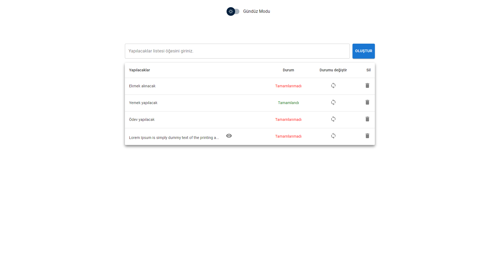
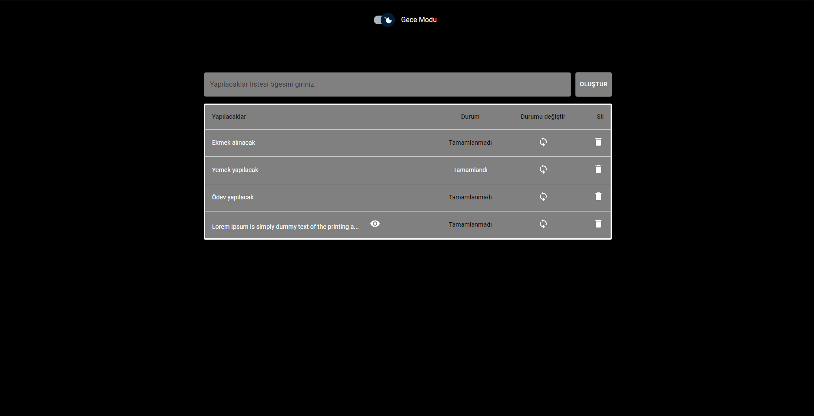
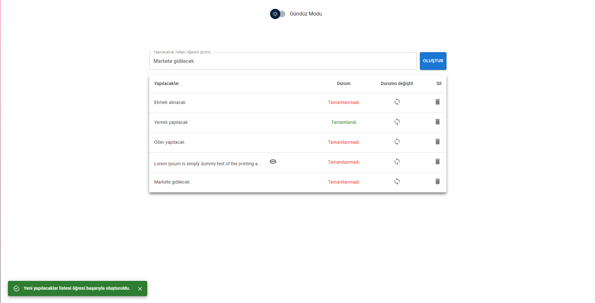
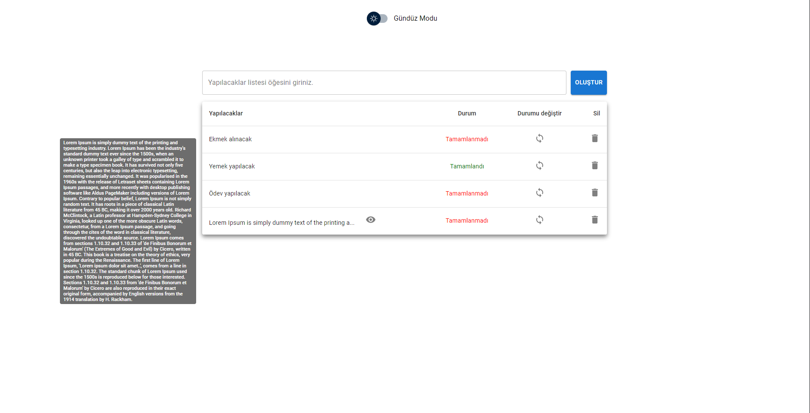
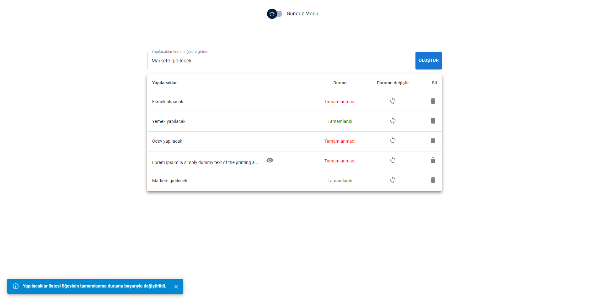
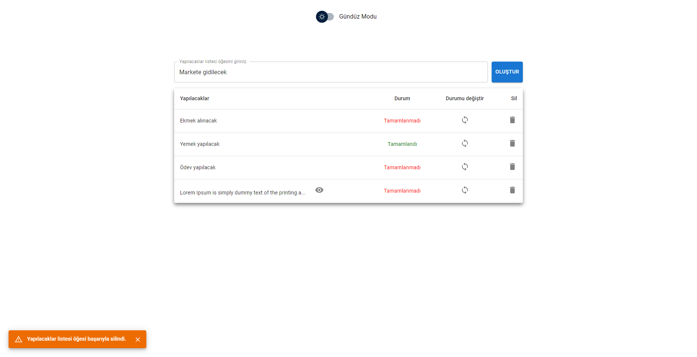

# Getting Started with Create React App

<h3>Gündüz Modu</h3>

Sayfa ilk açıldığında default olarak gündüz modunda açılır.

<h3>Gece Modu</h3>

Switch button ile gece moduna çevirerek renklerin koyu tonlara dönüştürülmesi sağlanır.

<h3>Yeni to do öğresi girişi</h3>

Yeni bir to do öğesi girişi yapılırsa;

<h3>Uzun Metin</h3>

Girilen to do öğesi uzun bir metin olursa sistemin yanıtı;

<h3>Tamamlandı / Tamamlanmadı</h3>

To do öğresinin tamamlanma durumlarının takibi;

<h3>Silindi</h3>

To do öğesinin silinmesi;

